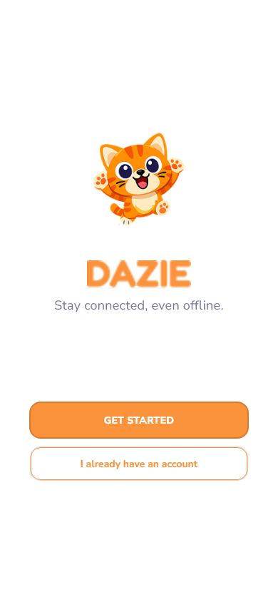
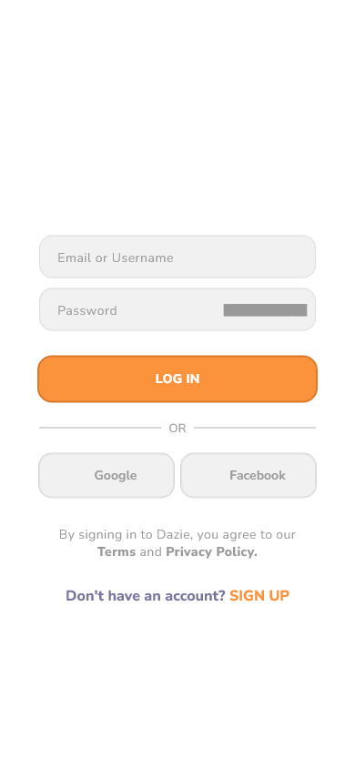
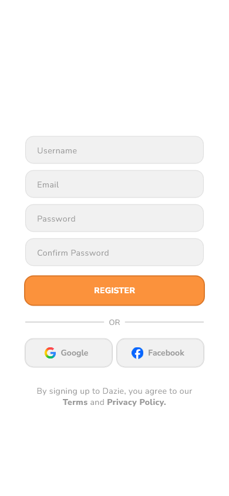
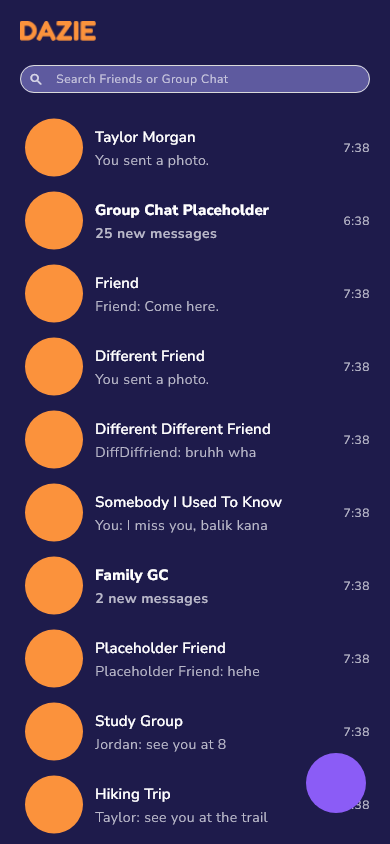
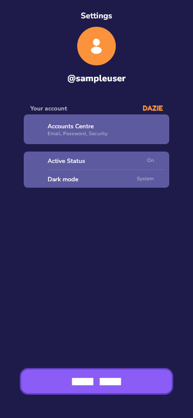
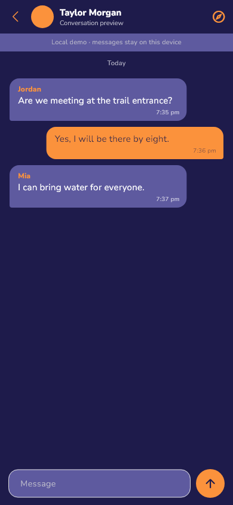
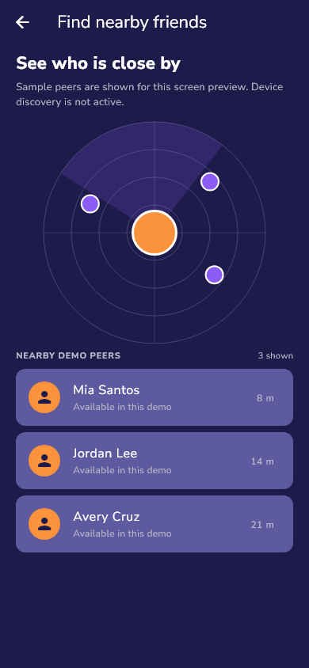
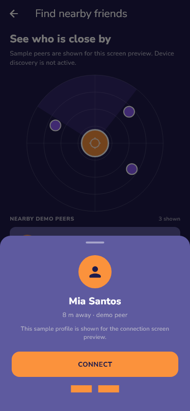
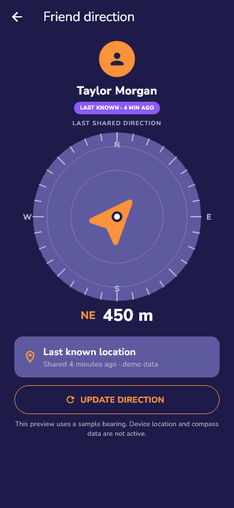

# Final Project

**Project:** Dazie

## My project repository

- Public repository: [Dazie on GitHub](https://github.com/prinpami/Dazie) 
- Live app: Not deployed.

## 1. Overview

Dazie is an offline-first communication concept for friends, families, classmates, and small groups who need to coordinate when mobile internet is unreliable. This Flutter prototype has welcome, account, conversation, nearby-peer, chat, compass, and settings screens, with local demo interactions and no backend or device-to-device connection yet.

## 2. Setup and installation

The project was built with Flutter 3.47.5 (stable) and Dart 3.13.4. Install Flutter with Dart included, then clone the repository and fetch its packages:

```sh
git clone https://github.com/prinpami/Dazie.git
cd Dazie
flutter pub get
```

No API key, backend URL, or account setup is needed for this demo. The login and registration forms use local validation and do not send or save credentials.

## 3. How to run it

On Windows with Edge configured as a Flutter device, run:

```sh
flutter run -d edge
```

On a machine configured with Chrome, use `flutter run -d chrome`. A working launch opens Dazie's welcome screen with its mascot, tagline, and account buttons. Run `flutter test` to check the current widget flow and screen references. After changing the UI, refresh the captured screen references with `flutter test --update-goldens test/screen_reference_test.dart`.

## 4. Features and usage

1. **Welcome:** Choose **GET STARTED** to open registration, or choose **I already have an account** to open login.
2. **Login and registration:** Enter sample values and submit. Local form validation advances to the conversation list; credentials are neither authenticated nor saved.
3. **Home:** Search the sample conversations. Tap a conversation to open its chat preview, the compose icon or radar shortcut to open nearby discovery, and the menu icon to open settings.
4. **Nearby discovery:** Select a sample peer to open its connect sheet. **CONNECT** changes that peer to a local connected state and reveals a button to open its chat. The peer list is fixed demo data; no device scan runs.
5. **Chat:** Review seeded sample messages and send a message to add it to the current in-memory conversation. Use the compass icon to open the direction preview. Messages are not transmitted or saved after leaving the screen.
6. **Compass:** Review the sample bearing and last-known location timestamp. The update button explains that live location and compass sensors are not connected.
7. **Settings:** Toggle Active Status, preview appearance options, and choose **LOG OUT** to return to the welcome screen. These settings reset when the screen is reopened.

Google and Facebook buttons show that provider sign-in is planned; neither button starts a real sign-in flow. All displayed people and conversations are sample data.

## 5. Project structure

```text
assets/
  fonts/                 Fredoka and Nunito Sans font files
  images/                Supplied brand graphics and interface icons
lib/
  main.dart              App entry point and named screen routes
  models/                In-memory chat message model
  screens/               Welcome, login, registration, home, chat, discovery, compass, settings
  theme/                 Brand colors, typography, and spacing
  widgets/               Shared forms, chat controls, discovery radar, compass dial, settings
test/
  app_flow_test.dart              Asset and local demo-flow checks
  screen_reference_test.dart      390 x 844 screen captures
  screenshots/                    Captured screen reference images
README.md                  Setup, usage, project map, and roadmap
SECURITY-CHECKLIST.md       Pre-release security review
AI-USAGE.md                 AI assistance disclosure
```

## 6. Screenshots

These references are captured from the current Flutter widgets at a 390 × 844 viewport.

### Welcome



### Login



### Registration



### Home



### Settings



### Chat



### Nearby discovery



### Peer connection preview



### Compass



## 7. Known issues and next steps

- Accounts are not created or authenticated, and form values are not saved.
- Chat, group creation, nearby discovery, and direction screens are UI previews. Chat messages and peer connection state are temporary local demo state; real messaging, device discovery, GPS, and compass sensors are not implemented.
- Provider sign-in and settings persistence are prototypes.
- Next, define replaceable service interfaces, add local persistence, and test actual nearby messaging and last-known direction on supported devices.

## Presentation

- Video (public Google Drive link): Not published.
- Slides or PDF: Not published.
- Square image: [Dazie mascot](assets/images/Dazie_Logo.png).

## AI usage

Read [AI-USAGE.md](AI-USAGE.md) for the tools used, the work they helped with, and what the student still needs to review.

## Security checklist

See [SECURITY-CHECKLIST.md](SECURITY-CHECKLIST.md). GitHub repository settings still need a signed-in owner check before the repository is made public.
