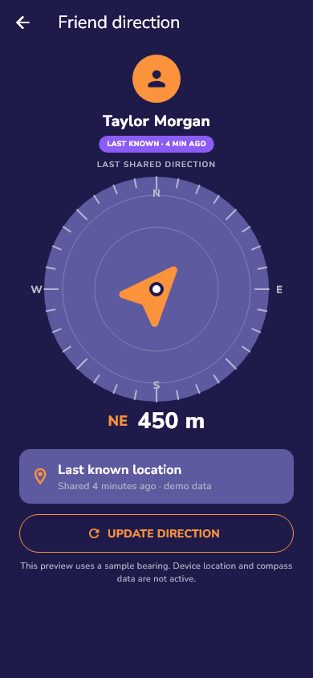

# Dazie

Dazie is my Flutter project, created and maintained by Prios ([@prinpami](https://github.com/prinpami)). It is an offline-first group communication app for friends, families, classmates, and small groups who need to coordinate when mobile internet is unreliable.

## Repository

- **Project author:** Prios ([@prinpami](https://github.com/prinpami))

## My project repository

- Public repository: [Dazie on GitHub](https://github.com/prinpami/Dazie) 
- Live app: Not deployed.

## 1. Overview

Dazie is an offline-first group chat and direction-finding app for friends, families, classmates, and small groups. It stores profiles, conversations, and messages locally, and Android devices can discover one another and exchange group and message data over nearby connections without mobile data.

The project is currently a working Flutter prototype: account screens are local, nearby chat is functional on supported Android devices, and the compass screen still uses demonstration data.

## 2. Setup and installation

The project was built and tested with Flutter 3.44.2 (stable) and Dart 3.12.2. Android testing uses Android SDK 37 and Android Build-Tools 36.0.0. Install Flutter with Dart included, install the Android SDK components, then clone the repository and fetch its packages:

```sh
git clone https://github.com/prinpami/Dazie.git
cd Dazie
flutter pub get
```

No API key or backend URL is required. On Android, grant Bluetooth, nearby Wi-Fi, and location permissions when Dazie asks for them. Both test phones must have Bluetooth and Wi-Fi enabled, Location enabled when requested by Android, and the app installed from a debug build.

## 3. How to run it

Run the desktop or web preview with:

```sh
flutter run -d chrome
# or
flutter run -d linux
```

For two physical Android phones, first confirm that both are authorized:

```sh
adb devices -l
flutter devices
```

Then use two terminals from the project directory:

```sh
flutter run -d DEVICE_ID_1
flutter run -d DEVICE_ID_2
```

Replace each `DEVICE_ID` with the serial shown by `adb devices`. A successful launch opens the Dazie welcome screen. Run `flutter test` for the automated checks; the current test suite also contains captured screen references.

## 4. Features and usage

1. **Welcome:** Choose **GET STARTED** to create a local profile, or choose **I already have an account** to open login.
2. **Login and registration:** Enter a username, email, and matching password. The profile is stored locally with Sembast; there is no online authentication.
3. **Home:** Search the sample conversations. Tap a conversation to open its chat preview, the compose icon or radar shortcut to open nearby discovery, and the menu icon to open settings.
4. **Nearby discovery:** On Android, tap **HOST A GROUP** on one phone and **FIND A GROUP** on the other. Compare the authentication code in the connection sheet, accept the request, and wait for the group and recent messages to sync. Bluetooth, Wi-Fi, nearby-device, and location permissions must be granted.
5. **Chat:** Open the synced group, send messages, and watch delivery move from queued to sent or delivered when devices connect. Messages and conversations are persisted locally and queued for later nearby delivery.
6. **Compass:** Review the sample bearing and last-known location timestamp. The update button explains that live location and compass sensors are not connected.
7. **Settings:** Toggle Active Status, preview appearance options, and choose **LOG OUT** to return to the welcome screen. Settings are stored locally.

Google and Facebook buttons show that provider sign-in is planned; neither button starts a real sign-in flow. All displayed people and conversations are sample data.

## 5. Project structure

```text
assets/
  fonts/                 Fredoka and Nunito Sans font files
  images/                Supplied brand graphics and interface icons
lib/
  main.dart              App entry point and named screen routes
  models/                Profile, peer, conversation, and chat message models
  screens/               Welcome, login, registration, home, chat, discovery, compass, settings
  data/                  Sembast database and profile, peer, conversation, message, and settings repositories
  services/              Nearby transport and chat synchronization services
  theme/                 Brand colors, typography, and spacing
  widgets/               Shared forms, chat controls, discovery radar, compass dial, settings
test/
  app_flow_test.dart              Asset and local demo-flow checks
  screen_reference_test.dart      390 x 844 screen captures
  screenshots/                    Captured screen reference images
docs/
  device-test-proof.jpg      Supplied two-phone Android verification photo
README.md                  Setup, usage, project map, and roadmap
SECURITY-CHECKLIST.md       Pre-release security review
AI-USAGE.md                 AI assistance disclosure
```

## 6. Screenshots

These references are captured from the current Flutter widgets at a 390 × 844 viewport.
The physical-device verification photo below shows Dazie running on two Android phones and exchanging messages. Save the supplied photo as `docs/device-test-proof.jpg` so it renders in the repository.

### Two-device verification


### Welcome


### Login


### Registration


### Home


### Settings


### Chat


### Nearby discovery


### Peer connection preview


### Compass



## 7. Known issues and next steps

- Online authentication is not implemented; profiles are local to each device.
- Nearby chat currently depends on Android Nearby Connections and requires the relevant runtime permissions.
- The compass and location display use sample bearing and distance data; live sensors and location sharing are not implemented.
- Provider sign-in buttons are placeholders.
- The app has been verified on two connected Android phones, but more device models and Android versions still need testing.
- Some existing widget tests still need the required `services` fixture argument before the full test suite is green.
- Next steps are to improve reconnection and conflict handling, add more automated Android integration coverage, and replace demonstration direction data with permission-aware location and compass services.

## Presentation

- Video (public Google Drive link): Not published.
- Slides or PDF: Not published.
- Square image: [Dazie mascot](assets/images/Dazie_Logo.png).

## Authorship and AI usage

This is Prios's project. Prios designed the product direction, supplied the visual assets, made implementation decisions, tested the app on two Android devices, and wrote approximately 40% of the current codebase. AI assistance accounts for approximately 60% of the implementation; the specific contributions, corrections, and ownership record are documented in [AI-USAGE.md](AI-USAGE.md).

## AI usage

Read [AI-USAGE.md](AI-USAGE.md) for the AI-assisted work record, review decisions, and code ownership details.

## Security checklist

See [SECURITY-CHECKLIST.md](SECURITY-CHECKLIST.md). GitHub repository settings still need a signed-in owner check before the repository is made public.
