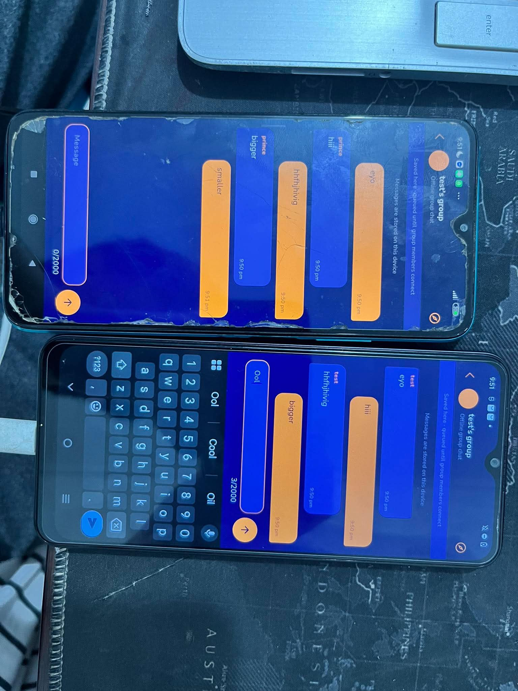
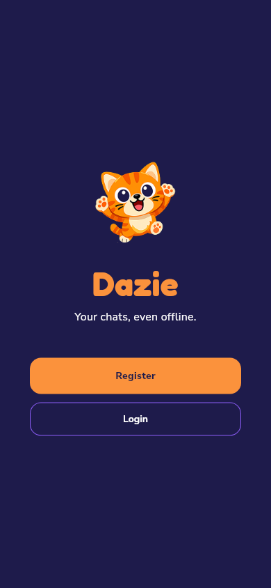
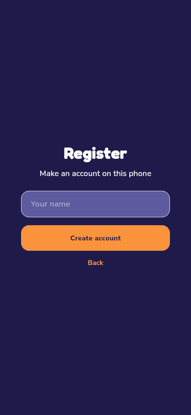
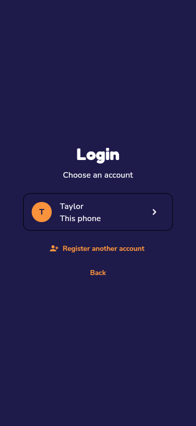
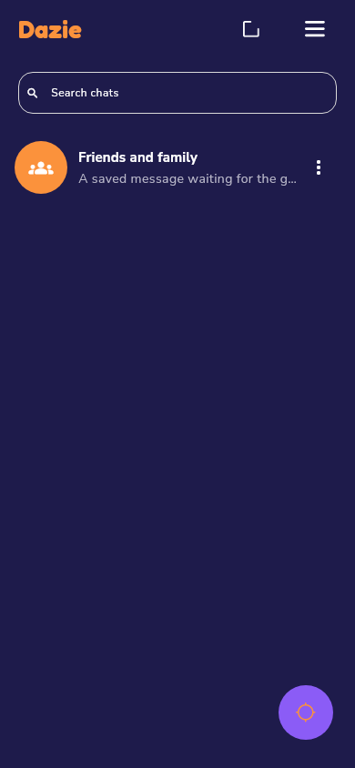
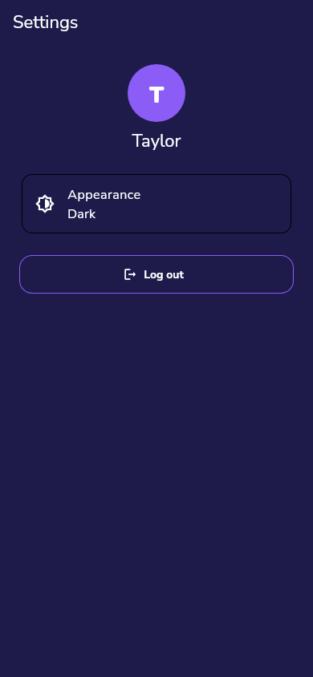
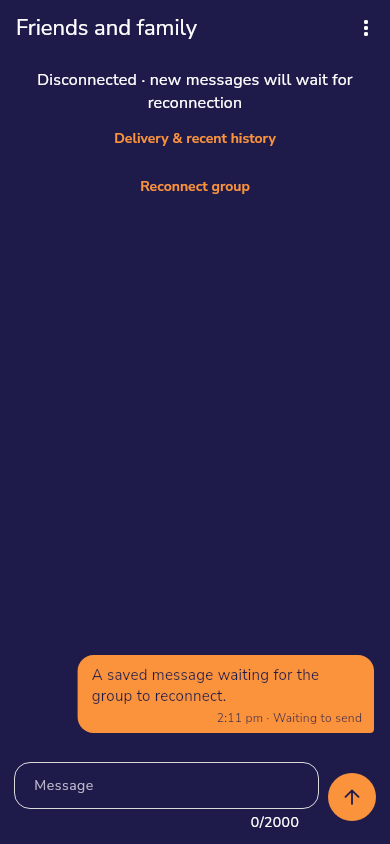
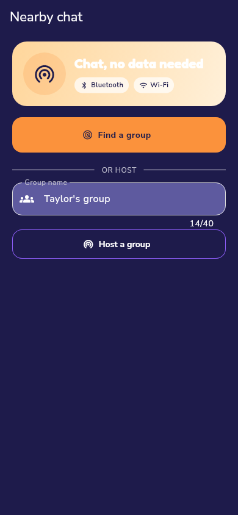
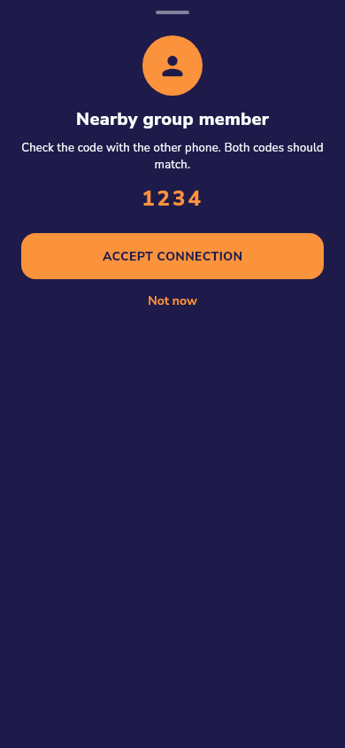

# Dazie

Dazie is my Flutter project, created and maintained by Prince Pamintuan ([@prinpami](https://github.com/prinpami)). It is an offline-first group communication app for friends, families, classmates, and small groups who need to coordinate when mobile internet is unreliable.

## Repository

- **Project author:** Prince Pamintuan ([@prinpami](https://github.com/prinpami))

## My project repository

- Public repository: [Dazie on GitHub](https://github.com/prinpami/Dazie) 
- Live app: Not deployed.

## 1. Overview

Dazie is an offline-first group chat app for friends, families, classmates, and small groups. It stores profiles, conversations, and messages locally, and Android devices can discover one another and exchange group and message data over nearby connections without mobile data.

The project is currently a working Flutter prototype: accounts and chats are stored on the phone, and nearby chat is available on supported Android devices. Login selects a saved on-device account; it does not contact an online service. Friend location sharing is not included.

## 2. Setup and installation

The project was built and tested with Flutter 3.44.2 (stable) and Dart 3.12.2. Android testing uses Android SDK 37 and Android Build-Tools 36.0.0. Install Flutter with Dart included, install the Android SDK components, then clone the repository and fetch its packages:

```sh
git clone https://github.com/prinpami/Dazie.git
cd Dazie
flutter pub get
```

No API key or backend URL is required. The Android minimum is API 24 (Android 7.0); Android 6 and earlier cannot install this Flutter build. Nearby chat also requires Google Play services. Grant the Bluetooth and nearby-device permissions Dazie requests. Android 12L and earlier also require Location permission and Location to be enabled for nearby device discovery; Dazie does not use that permission to show or share anyone's GPS location. Both phones need Bluetooth and Wi-Fi enabled, and the app installed from a debug build.

## 3. How to run it

Run the desktop or web preview with:

```sh
flutter run -d chrome
# or
flutter run -d linux
```

For two physical Android phones, first confirm that both are authorized:

```sh
adb devices -l
flutter devices
```

Then use two terminals from the project directory:

```sh
flutter run -d DEVICE_ID_1
flutter run -d DEVICE_ID_2
```

Replace each `DEVICE_ID` with the serial shown by `adb devices`. An active account opens directly to its chats; otherwise, Dazie shows Login and Register. Run `flutter test` for widget and service checks. The Android account and nearby-screen flow can be exercised with `flutter test integration_test/account_and_nearby_flow_test.dart -d DEVICE_ID`.

Run the Android integration command only on an emulator or a dedicated test phone: Flutter's integration runner reinstalls the test app and can clear Dazie's on-device accounts and chats. Back up any local data you need before running it.

## 4. Features and usage

1. **Login and Register:** Register an account with a display name. To use a saved account, tap **Login** and choose it. Register can add multiple accounts to the phone. There is no password or online sign-in; a person with access to the phone can select its saved accounts.
2. **Home:** Dazie opens to chats for the selected account. Search chats or use the nearby shortcut to start one. Settings contains appearance and **Log out**; logging out stops nearby activity and keeps the account and its chats saved.
3. **Nearby chat:** Tap **Host a group** on one phone and **Find a group** on the other. Compare and accept the matching connection codes on both phones. Bluetooth and Wi-Fi are used for nearby transfer; mobile data is not needed. Android 12L and earlier also require Location permission and Location enabled for device discovery. Dazie does not track friends or share GPS positions.
4. **Chat:** Messages are saved locally. Long press or right-click a message for local deletion; keyboard users can focus it and press Enter or Space, and screen readers expose a Message options action. Deletion does not remove other devices’ copies. Streams show loading, empty, and retryable error states separately.
5. **Settings:** **Appearance** applies System, Light, or Dark across all screens and is saved for the next launch. **Log out** stops nearby activity and returns to Login/Register. The account and its conversations stay on the phone.

### Delivery and recent history

| Stored status | Visible label | Meaning |
| --- | --- | --- |
| `queued` | Waiting to send | Saved locally; no successful transport send yet. |
| `sent` | Sent to a nearby device | A send was accepted by the transport for at least one connected peer. Receipt is not yet confirmed. |
| `delivered` | Confirmed by a nearby device | At least one peer acknowledged the message, or returned a copy. That peer may be only the host. |

These are not read receipts or confirmation from every group member. Recipient-specific receipts are deferred because they require a per-recipient storage and relay protocol. Pending local messages retry on reconnection. Once a message has one confirmation, other members may still be missing it.

On join/reconnect, the host sends its **latest 50 saved messages**, plus pending retries. This is a recent window, not full-history sync; older messages may be absent on joining devices. The chat’s **Delivery & recent history** help explains both limits.

### Storage and packet compatibility

No database migration or reset is required. Existing Sembast `profiles/current`, groups, messages, deletion tombstones, and `settings/app` records remain readable. New profiles keep the existing map shape with an empty legacy email field. Existing profile IDs, emails, creation dates, and conversations are preserved. The unused stored `activeStatus` value is retained for compatibility.

Outgoing JSON has a versioned envelope (`version: 1`, `type`, and the existing type-specific fields). Valid unversioned packets from earlier builds are still accepted; unknown versions, unknown types, invalid required fields, invalid timestamps, and malformed/oversized JSON are ignored before local writes. Sender identity and group membership checks remain in place. Incoming `isMine` and delivery status never override the receiving device’s interpretation. Mixed-version interoperability has automated packet coverage, not new physical-device verification.

### Future features

These ideas are deferred and are not available in the current app:

- Online authentication, including Google and Facebook sign-in.
- Friend radar and live location or direction sharing.

The nearby group finder uses Bluetooth and Wi-Fi device discovery for chat. It does not track or display friends on a map.

## 5. Project structure

```text
assets/
  fonts/                 Fredoka and Nunito Sans font files
  images/                Supplied brand graphics and interface icons
lib/
  main.dart              App entry point and named screen routes
  models/                Profile, peer, conversation, and chat message models
  screens/               Login, registration, home, chat, discovery, settings
  data/                  Sembast database and profile, peer, conversation, message, and settings repositories
  services/              Nearby transport and chat synchronization services
  theme/                 Brand colors, typography, and spacing
  widgets/               Shared forms, chat controls, settings
test/
  app_flow_test.dart              Profile, discovery, and deletion flows
  prototype_polish_test.dart      Profile preservation, themes, settings, stream states
  nearby_packet_test.dart         Packet validation, receipt meaning, history window
  connectivity_test.dart          Permissions and simulated peer sync
  screen_reference_test.dart      Light/dark layouts at 320/390px and 1x/2x text, keyboard
integration_test/
  account_and_nearby_flow_test.dart Login/register/logout and nearby screens on Android
  screenshots/                    Current widget captures and historical device photo
README.md                  Setup, usage, project map, and roadmap
SECURITY-CHECKLIST.md       Pre-release security review
AI-USAGE.md                 AI assistance disclosure
```

## 6. Screenshots

Current screen references were refreshed on October 4, 2026 from Flutter widgets at 390 × 844, dark appearance, normal text size, with bundled fonts and local fixture data. They are automated captures, not physical-device verification. The obsolete compass reference was removed. To regenerate the full light/dark and text-size matrix into `/tmp/dazie-ui`:

```sh
flutter test --dart-define=CAPTURE_UI=true test/screen_reference_test.dart
```

The photo below is historical evidence supplied for the September 27 device test. No physical-device verification was performed for the October 4 polish.

### Historical two-device verification



### App entry



### Register



### Login



### Home



### Settings



### Chat



### Nearby discovery



### Peer connection confirmation



## 7. Known issues and next steps

- Online authentication is not implemented; profiles are local to each device and passwords are not stored.
- Android 6 and earlier are below the current Flutter minimum (API 24). This build supports Android 7.0 and newer.
- Nearby chat currently depends on Android Nearby Connections and requires the relevant runtime permissions.
- Nearby discovery requires Google Play services; devices without it can use saved chats but cannot join nearby sessions.
- Android 12L and earlier require Location permission for Nearby Connections scanning. That permission supports device discovery and is not used to share friend locations.
- The Redmi M2010J19SG on Android 11 (API 30) launched this build and passed the on-device account and screen-flow test. Host/find, code acceptance, group relay, reconnect, and mixed-version behavior still need a two-phone pass.
- Automated tests cover simulated two-peer sync and permission selection from API 23 through API 37; real Nearby behavior still needs testing across more phone models and Android versions.
- Next steps are to improve reconnection and conflict handling and add two-device Android integration coverage.

Google and Facebook sign-in, friend radar, and live location or direction sharing are deferred future features.

## Presentation

- Video (public Google Drive link): [Link](https://drive.google.com/drive/folders/1ILuZ57HYMAdi_anhdAbkyuAccsT6Qaz-?usp=sharing)
- Slides or PDF: [Slides PDF](https://drive.google.com/file/d/181MFmaMaEBh9ziOzTtj-61_qp2NWu1iZ/view?usp=sharing)
- Square image: [Dazie mascot](assets/images/Dazie_Logo.png).

## Authorship and AI usage

This is my Flutter project. I came up with the offline-first group chat idea and worked mostly on the screens and app flow. I also did parts of Login and Register and some basic database and service setup. **AI credit:** I used OpenAI Codex for about 78% of the code; I wrote about 22%. See [AI-USAGE.md](AI-USAGE.md) for examples and commit links.

## Security checklist

See [SECURITY-CHECKLIST.md](SECURITY-CHECKLIST.md). GitHub repository settings still need a signed-in owner check before the repository is made public.
